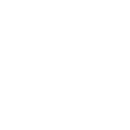

<p align="center">
  
</p>

<h1 align="center">AlphaGen</h1>

<p align="center">
  <strong>GPU-Accelerated Procedural Alpha & Mask Texture Generator for Unreal Engine 5</strong><br>
  <em>Unreal Engine 5.4 – 5.8 | Win64</em>
</p>

<p align="center">
  <a href="../../releases"></a>
  
  
  
</p>

---

## Overview

**AlphaGen** is a real-time procedural alpha, brush, and mask texture generation toolkit built natively for Unreal Engine 5. Powered by custom HLSL compute shaders via the Render Dependency Graph (RDG), AlphaGen allows you to design, filter, and export high-resolution alphas (up to 8K) directly inside the Unreal Editor without ever needing to jump into Photoshop or external DCC tools.

> [!NOTE]
> *This repository has a clean commit history because AlphaGen was previously developed inside a private monorepo. It has now been separated and made public on GitHub.*

---

## Features

### 1. 21 Procedural Generators
Generate complex masks using GPU compute shaders in real time:
- **Noise & Organic:** Perlin Noise, Voronoi Cells, Seamless Tiling Noise, Caustics, Grunge, Fibers, Cells.
- **Surface & Damage:** Cracks, Splatter, Tears, Scratches, Crosshatch.
- **Geometric & Patterns:** Radial, Circle, Square, Diamond, Bricks, Dots, Checkerboard, Hexagon, Waves.

### 2. 14 Post-Processing GPU Filters
Stack and blend post-processing filters using ping-pong compute buffers:
- **Distortion & Warping:** Domain Warp, Spherize, Spiral.
- **Morphology:** Dilate, Erode.
- **Enhancement & Styling:** Gaussian Blur, Sharpen, Edge Detect, Invert, Threshold, Posterize, Pixelate.
- **Tonal Control:** Levels, Contrast.

### 3. Editor Workflow & Live Preview
- **Toolbar Integration:** Dedicated icon in the Unreal Editor Level Viewport toolbar.
- **Live Preview Slate Widget:** Real-time interactive preview as you adjust parameters, seeds, and frequencies.
- **Texture Pooling:** Fast, memory-conscious texture reuse (`AlphaTexturePool`) to keep the editor responsive.
- **High-Resolution Export:** Export up to 8192×8192 (8K) directly into your project's Content Browser as an optimized `UTexture2D` asset or export to disk as PNG.

---

## Requirements

- **Engine Versions:** Unreal Engine 5.4, 5.5, 5.6, 5.7, 5.8
- **Platform:** Windows (Win64)
- **DirectX:** DirectX 11 / DirectX 12 with Compute Shader support

---

## Installation

### Option A: Pre-built Binaries (UE 5.8)
1. Download `AlphaGen-v1.0.0-UE5.8-Win64.zip` from the [GitHub Releases](../../releases) page.
2. Extract the `AlphaGen` folder into your project's `Plugins/` folder:
   ```text
   YourProject/
   └── Plugins/
       └── AlphaGen/
           ├── AlphaGen.uplugin
           ├── Binaries/
           ├── Config/
           ├── Docs/
           ├── Resources/
           ├── Shaders/
           └── Source/
   ```
3. Launch your project in Unreal Engine 5.8. When prompted, enable the plugin and restart.

### Option B: Building from Source (UE 5.4 – 5.8)
1. Clone this repository into your project's `Plugins/` directory:
   ```bash
   cd YourProject/Plugins
   git clone https://github.com/ephemara/AlphaGen-UE5.git AlphaGen
   ```
2. If compiling for UE 5.4 – 5.7, open `AlphaGen.uplugin` in a text editor and ensure the engine version matches your project.
3. Right-click your `.uproject` file and select **Generate Visual Studio project files**.
4. Open the solution in Visual Studio or Rider and build your project in the **Development Editor** configuration.

---

## Quick Start

1. Click the **AlphaGen** icon in the level editor toolbar to open the generator window.
2. Choose a generator type from the dropdown (e.g. *Voronoi*, *Perlin*, or *Caustics*).
3. Adjust frequency, octaves, roughness, and seed values with live feedback.
4. Add post-process filters (such as *Domain Warp* or *Edge Detect*) to customize the mask.
5. Select your target resolution (512 to 8192) and click **Export to Project**.

---

## License

This project is licensed under the MIT License - see the [LICENSE](LICENSE) file for details.
